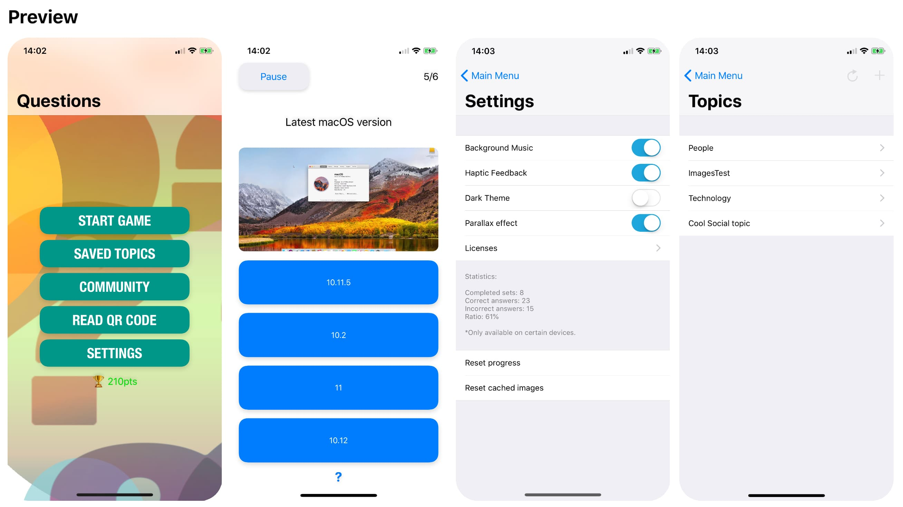
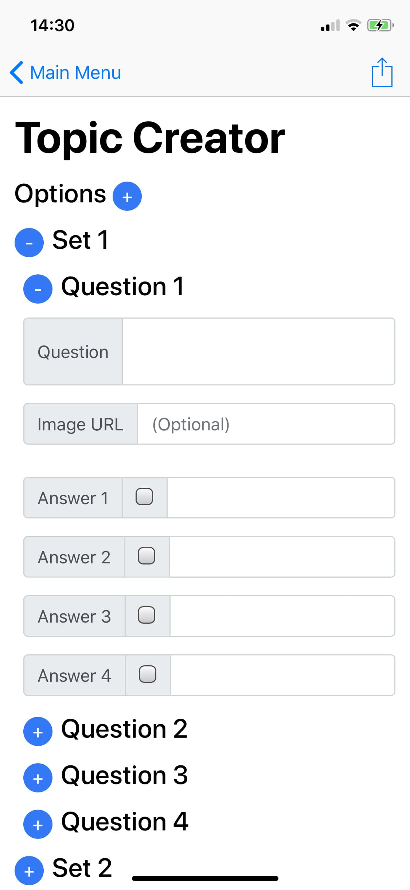
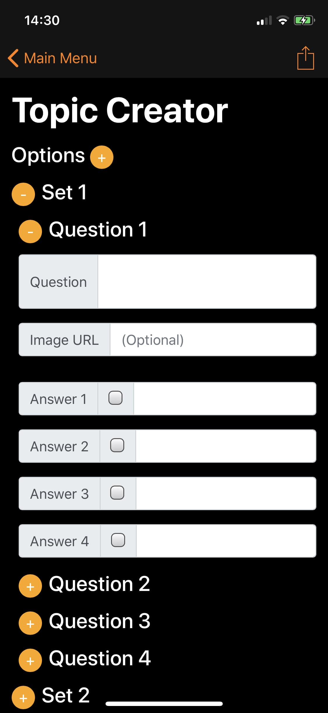

# Questions
[](https://swift.org/download)
[](https://github.com/illescasDaniel/Questions/releases)
[](https://github.com/illescasDaniel/Questions/blob/master/LICENSE)

[](https://trello.com/b/9YLvTM6S)
[](https://install.appcenter.ms/users/illescas-daniel/apps/Questions)

Prototype of a Quiz app for iOS.

## Trello

Check our [trello board](https://trello.com/b/9YLvTM6S) to follow the app roadmap, post your suggestions, vote your favourite features, etc.

## Testing

You can test the app in your device easily by downloading it from AppCenter (formerly HockeyApp) from [here](https://install.appcenter.ms/users/illescas-daniel/apps/Questions).  

Features
-------------
- Questions statistics
- Reset statistics and/or settings
- Parallax effect on main menu
- Haptic feedback
- Multilanguage support
- Repeat quizzes by shaking the device
- Read Questions from a QR Code saving them for later use
- Read Questions form a URL
- Questions can have multiple correct anwers
- Each set of questions can have different number of answers
- Each question can have an image that will appear below the question text (this will load asynchronously and will be cached)
- Add sets of questions / new topics just by dragging a formatted json file to Xcode
- You can specify some options for the questions sets, like specify a timer, show the questions in random order or not, enable the help button, etc.
- The app offers OPTIONAL privacy features such as blurring the multitask screenshot, detecting if the user is capturing the screen or if it took a screenshot
- Community topics! A section where submited topics are available for all the users.
- Creators section! You can create your own questions, save it, send it to friends, etc.
- Dark theme
- Switch between themes by:
	- Swiping up/down with 2 fingers
	- Using a home quick action  

(The questions included are just some simple examples.)

Screenshots
-------


- [More screenshots](http://imgur.com/a/OOrLJ)
- [Demo Video](https://twitter.com/Daniel_ir96/status/955496091943931905)
- [Community Topics demo video](https://twitter.com/daniel_ir96/status/986942413301219328)


Community Topics
--
Since v3.9 any user is able to submit his own topics to the community!

The example community file containning the topics URL is hosted [here](https://pastebin.com/hgmNQ0xh) 

The file is parsed asynchronously in the app and loaded.

You can create more topics and upload them to pastebin, then in the app you send me its URL.

Topic Creator 
--
Since v3.11 anyone is able to create their own topics within the app!
You can save it or share it with a friend if you want.

 

Topics JSON format
---
```java
{
    options": {
        "name": "Cool Social topic",
        "timePerSetInSeconds": 300,
        "questionsInRandomOrder": false,
        "helpButtonEnabled": false,
        "showCorrectIncorrectAnswer": false
    },
    "sets": [
        [
            {"question": "How old is Barack Obama?", "answers": ["> 50", "< 50", "35 ☺️", ">60 👴🏿"], "correct": 0, "imageURL": "https://somecoolWeb/image.jpg"},
            {"question": "Google CEO", "answers": ["Larry Page", "Sergey Brin", "Sundar Pichai", "Andy Rubin"], "correct": 2}
        ],
        [
            {"question": "When was Tim Cook born?", "answers": ["1967", "1970", "1940", "1960", "Test"], "correctAnswers": [3,4]},
            {"question": "When did Steve Jobs die?", "answers": ["2008", "2010", "2011", "2012", "3012"], "correct": 2}
        ]
    ]
}
```
### Simple explanation:
* A topic is defined as an array of sets of questions. Ideally this sets are about the same topic...
* Each set of questions can have a different number of answers BUT all the answers in each set need to have the same number.
* Whithing a question, the answers can't repeat; as well as the correct answers.
* You can also use some images which will show below the specific questions. You must specify a URL of that image (I think the link must start with "https"). The image will load asychronously and it will be cached for later faster use too.
* Each question can have 1 or multiple correct answers. Use "correct" for a unique correct answer and "correctAnswers" for multiple ones. If you use both ("correct", "correctAnswers") it will add the "correct" index to the other array (is a set so it won't repeat).
* Each topic (JSON file) can have specific options that are optional to specify, see below for more details.  

The rest can be deduced :)

### Options. Possible keys and values.

| Key        | Values           | Note  |
| ------------- |:-------------:| ----- |
| name      | `String` | If no name is specified, its name will be the same as its file name. |
| timePerSetInSeconds      | An `unsigned integer` or a `Double`      |   If ommited, there will be no timer. |
| questionsInRandomOrder | `Boolean` (true/false)      |   Random (true) by default.  |
| helpButtonEnabled | `Boolean` (true/false)      |  Could be overwritten by app settings and will be hidden if the number of answers is 2 or less. True by default.   |
| showCorrectIncorrectAnswer | `Boolean` (true/false)      |  True by default.   |
| multipleCorrectAnswersAsMandatory | `Boolean` (true/false)      |  False by default. If false, when a question has multiple answers only one is required to continue; true otherwise.  |

# ASSETS #

Images
-------
App background:  
https://pixabay.com/en/banner-header-question-mark-1090830/

Some icons:
https://icons8.com/

Sounds
-------
Royalty Free Music from Bensound:  
http://www.bensound.com/royalty-free-music/track/the-lounge

'Correct answer' sound:  
https://www.freesound.org/people/LittleRainySeasons/sounds/335908/

'Incorrect answer' sound'. "Game Sound Wrong.wav", creator: Bertrof.   
"This work is licensed under the Attribution License":  
https://creativecommons.org/licenses/by/3.0/legalcode  
https://www.freesound.org/people/Bertrof/sounds/131657/

# Special thanks to #

Carlos Rodriguez ([**@carlosrodriguez85**](https://github.com/carlosrodriguez85)) </br>
([**@gizmosachin**](https://github.com/gizmosachin)) and his awesome [VolumeBar](https://github.com/gizmosachin/VolumeBar) </br>
All the GitHub and StackOverflow community, also YouTube :)
