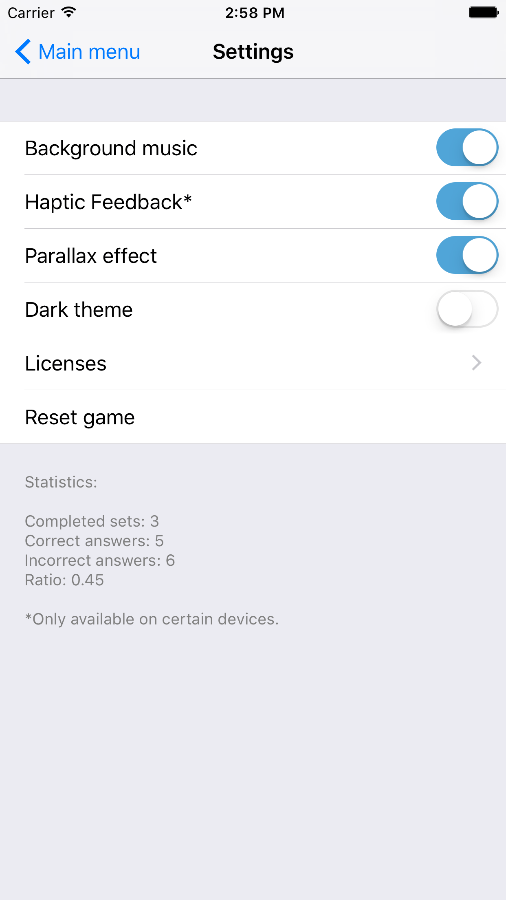
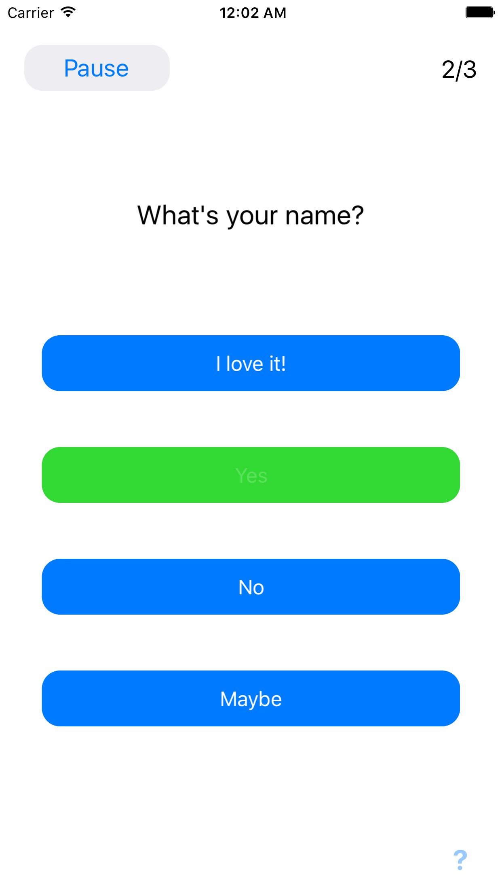
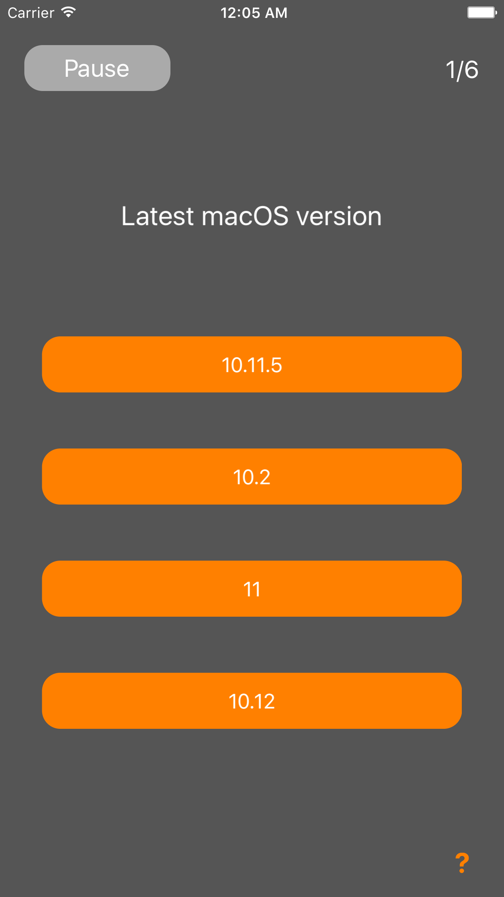

# Questions
[](https://swift.org/download)
[](https://github.com/illescasDaniel/Questions/releases)
[](https://github.com/illescasDaniel/Questions/blob/master/LICENCE)  

Prototype of a Quiz app for iOS.

Main Features
-------------
- Questions statistics
- Reset statistics and/or settings
- Parallax effect on main menu
- Haptic feedback
- Multilanguage support
- Repeat quizzes by shaking the device
- Read Questions from a QR Code and save them to use them later
- Add sets of questions / new topics just by dragging a formatted json file to Xcode
- Dark theme
- Switch between themes by:
	- Swiping up/down with 2 fingers
	- Using a home quick action  

(The questions included are just some simple examples.)

Screenshots
-------
     
     

- [More screenshots](http://imgur.com/a/OOrLJ)
- [Demo Video](https://twitter.com/Daniel_ir96/status/955496091943931905)


Topics JSON format (v3.2-beta)
---
```
{
	"topic": [
		[
			{"question": "How old is Barack Obama?", "answers": ["> 50", "< 50", "35", ">60"], "correct": 0},
			{"question": "Google CEO", "answers": ["Larry Page", "Sergey Brin", "Sundar Pichai", "Andy Rubin"], "correct": 2}
		],
		[
			{"question": "When was Tim Cook born?", "answers": ["1967", "1970", "1940", "1960", "Test"], "correct": 3},
			{"question": "When did Steve Jobs die?", "answers": ["2008", "2010", "2011", "2012", "3012"], "correct": 2}
		]
	]
}
```
### Simple explanation:
* A topic is defined as an array of sets of questions. Ideally this sets are about the same topic...
* Each set of questions can have a different number of answers BUT all the answers in each set need to have the same number
* For now each question has only 1 correct answer (this will probably change and could allow an array of possible correct answers)

The rest can be deduced :)


# ASSETS #

Images
-------
App background:  
https://pixabay.com/en/banner-header-question-mark-1090830/

Sounds
-------
Royalty Free Music from Bensound:  
http://www.bensound.com/royalty-free-music/track/the-lounge

'Correct answer' sound:  
https://www.freesound.org/people/LittleRainySeasons/sounds/335908/

'Incorrect answer' sound'. "Game Sound Wrong.wav", creator: Bertrof.   
"This work is licensed under the Attribution License":  
https://creativecommons.org/licenses/by/3.0/legalcode  
https://www.freesound.org/people/Bertrof/sounds/131657/

# Special thanks to #

Carlos Rodriguez ([**@carlosrodriguez85**](https://github.com/carlosrodriguez85)) </br>
([**@gizmosachin**](https://github.com/gizmosachin)) and his awesome [VolumeBar](https://github.com/gizmosachin/VolumeBar) </br>
All the GitHub and StackOverflow community, also YouTube :)
